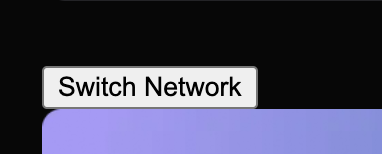

## Getting Started

WalletConnect で switch network するとエラーになるリポジトリ。

Metamask ではうまくいくが、Rainbow だとうまくいかない。

.env.local に Thirdweb の Client ID (`NEXT_PUBLIC_TEMPLATE_CLIENT_ID`) と、WalletConnect の ProjectID (`NEXT_PUBLIC_WALLETCONNECT_PROJECT_ID`) を入れてください。(`.env.example` を参考に)

その後
```
yarn -i
yarn dev
```

で動くはず

で、Connect Wallet ボタンを押してWalletを接続して、`switch network`ボタンを押すとエラーになります。

エラーの内容

```
 'Missing or invalid. request() method: wallet_switchEthereumChain'
console.error @ client.js:1
window.console.error @ setup-hydration-warning.js:18
LOG @ browser.js:202
eval @ browser.js:266
Q.request @ index.es.js:1
await in Q.request (async)
handleSwitchChain @ index.es.js:27
request @ index.es.js:27
request @ index.es.js:27
request @ index.es.js:1
switchChain @ thirdweb-dev-wallets-evm-connectors-wallet-connect.browser.esm.js:312
await in switchChain (async)
switchChain @ connector-05689d68.browser.esm.js:38
switchChain @ base-2087ffde.browser.esm.js:116
await in switchChain (async)
eval @ useTransactions-d703d04a.browser.esm.js:157
onClick @ index.tsx:48
callCallback @ react-dom.development.js:4164
invokeGuardedCallbackDev @ react-dom.development.js:4213
invokeGuardedCallback @ react-dom.development.js:4277
invokeGuardedCallbackAndCatchFirstError @ react-dom.development.js:4291
executeDispatch @ react-dom.development.js:9041
processDispatchQueueItemsInOrder @ react-dom.development.js:9073
processDispatchQueue @ react-dom.development.js:9086
dispatchEventsForPlugins @ react-dom.development.js:9097
eval @ react-dom.development.js:9288
batchedUpdates$1 @ react-dom.development.js:26140
batchedUpdates @ react-dom.development.js:3991
dispatchEventForPluginEventSystem @ react-dom.development.js:9287
dispatchEventWithEnableCapturePhaseSelectiveHydrationWithoutDiscreteEventReplay @ react-dom.development.js:6465
dispatchEvent @ react-dom.development.js:6457
dispatchDiscreteEvent @ react-dom.development.js:6430

```



ちなみに、このリポジトリは

```bash
npx thirdweb create 
```

で作ってから、最低限の追加実装だけしています。

